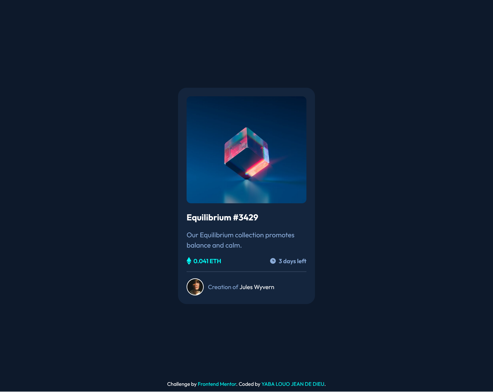
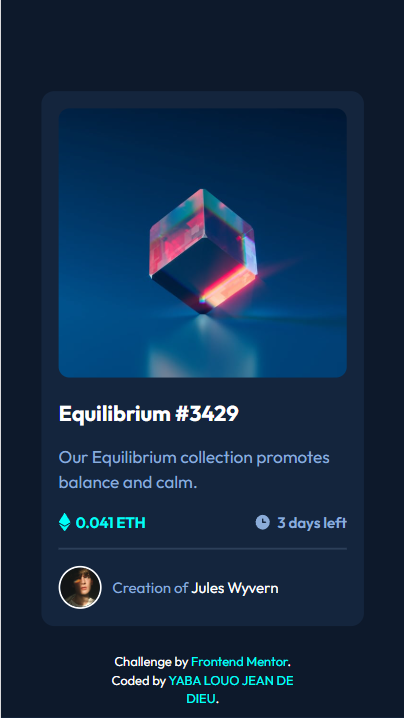

# Frontend Mentor - NFT preview card component solution

This is a solution to the [NFT preview card component challenge on Frontend Mentor](https://www.frontendmentor.io/challenges/nft-preview-card-component-SbdUL_w0U). Frontend Mentor challenges help you improve your coding skills by building realistic projects. 

## Table of contents

- [Overview](#overview)
  - [The challenge](#the-challenge)
  - [Screenshot](#screenshot)
  - [Links](#links)
- [My process](#my-process)
  - [Built with](#built-with)
  - [Continued development](#continued-development)
  - [Useful resources](#useful-resources)
- [Author](#author)

**Note: Delete this note and update the table of contents based on what sections you keep.**

## Overview

### The challenge

Users should be able to:

- View the optimal layout depending on their device's screen size
- See hover states for interactive elements

### Screenshot

### Links

- Solution URL: [https://github.com/victoire20/nft-preview-card-component](https://github.com/victoire20/nft-preview-card-component)
- Live Site URL: [https://victoire20.github.io/nft-preview-card-component](https://victoire20.github.io/nft-preview-card-component)

## My process

### Built with

- Semantic HTML5 markup
- CSS custom properties
- Flexbox
- Mobile-first workflow

### Continued development

I realized that when I use a transition for the appearance of the image view, it changes size when I remove the mouse, and I haven't found a solution for this yet.

### Useful resources

- [Google Fonts](https://fonts.google.com/specimen/Outfit)

## Author

- Website - [Github Page](https://github.com/victoire20)
- Frontend Mentor - [@victoire20](https://www.frontendmentor.io/profile/victoire20)
